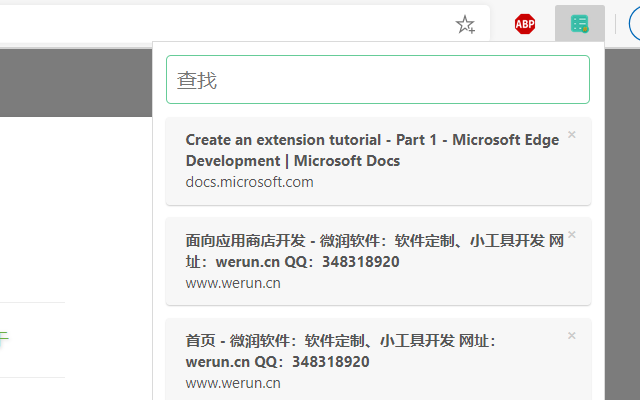
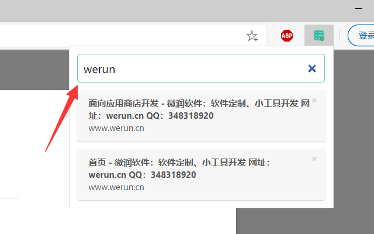

## General Usage
1. Click the menuitem "添加到稍后阅读" on the context menu of page.

2. Click toobar item to check out the url list. Click item to navigate.

3. Input keyword to search title or url.

## Publish
Get it by [Microsoft Edge Addon Store](https://microsoftedge.microsoft.com/addons/detail/%E7%A8%8D%E5%90%8E%E9%98%85%E8%AF%BB/caaapgpomaepmgnljhfpanhednkicfan)
