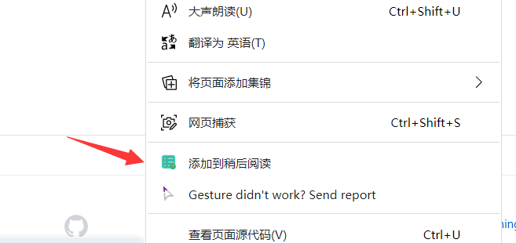

## General Usage
1. Right click the menuitem "添加到稍后阅读"

2. Click the Icon on toolbar to check the url list. Click the item to navigate.

3. Press the keyword to search title or url

## Publish
Get it on [Microsoft Edge Addon Store](https://microsoftedge.microsoft.com/addons/detail/%E7%A8%8D%E5%90%8E%E9%98%85%E8%AF%BB/caaapgpomaepmgnljhfpanhednkicfan)
